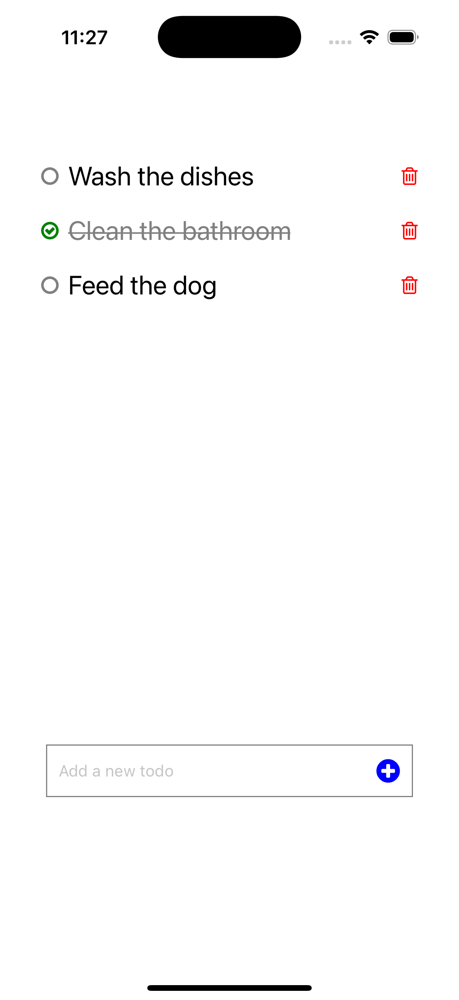

# Do it today - A React Native To-Do List App

[](https://opensource.org/licenses/MIT)





## Overview

**Do it today** is a productivity-focused to-do list application built with React Native and Expo. It's designed to help you manage your daily tasks with a unique twist: the to-do list resets every day at midnight! This encourages you to complete your tasks within the day and start fresh each morning.

## Features

*   **Add To-Do Items:** Easily add new tasks using the input field and the "+" button.
*   **Toggle Completion:** Mark tasks as complete by tapping the checkbox or the to-do item itself. Completed tasks are visually distinguished.
*   **Delete To-Do Items:** Remove tasks by tapping the trash can icon.
*   **Daily Reset:** The to-do list automatically resets at midnight (device time), giving you a clean slate each day.
*   **Persistent Storage:** Your to-do list is saved locally on your device using `AsyncStorage`, so your tasks are preserved even if you close the app.

## Planned Features

*   **Edit To-Do Items:** Ability to modify the text of existing tasks.
*   **Pomodoro Timer:** Integration of a Pomodoro timer to help you focus on tasks in short bursts.

## Technical Details

*   **React Native:** 0.76.7
*   **Expo:** ^52.0.35
*   **Dependencies:**
    *   `react-native-vector-icons`
    *   `@react-native-async-storage/async-storage`
    *   `react-native-uuid`
*   **Platforms:** iOS and Android
*   **Device Requirements:** This app has been tested on Android version 11+ and iOS version 14+. It is expected to work on most modern Android and iOS devices.

## Installation and Usage

1.  **Clone the repository:**

    ```bash
    git clone https://github.com/ronaldyonggi/doittoday
    cd doittoday/
    ```

2.  **Install dependencies:**

    ```bash
    npx expo install
    ```

3.  **Run the app:**

    ```bash
    npx expo start
    ```

    This will start the Expo development server. You can then run the app on an emulator/simulator or on a physical device using the Expo Go app.

4.  **Using the App:**
    *   **Add a to-do:** Type your task into the input field at the bottom of the screen and tap the blue "+" button.
    *   **Toggle completion:** Tap the circle on the left side of a to-do item, or tap the to-do item text itself, to mark it as complete or incomplete.
    * **Delete a to-do:** Tap the red trash can icon on the right side of the to-do item you want to delete.

## Contributing

Contributions are welcome! If you'd like to contribute, please fork the repository and submit a pull request.

## License

This project is licensed under the MIT License.
